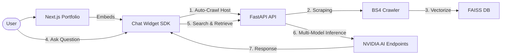

# Sriram M | Algorithmic Trading Systems Engineer & AI Architect

Welcome to the unified workspace of **Sriram M**. This repository contains a high-performance personal portfolio and an enterprise-grade **Universal RAG Chatbot** infrastructure.

---

## 🏗️ Project Overview

This is a mono-repo consisting of two primary components designed to work in harmony:

1.  **Portfolio Website (Root)**: A sleek, modern identity built with Next.js 15, featuring glassmorphism design and high-end animations.
2.  **[Universal RAG Chatbot](./chatbot)**: A self-healing AI engine that can be embedded into any website to provide instant, context-aware assistance using private data indexing.

---

## 🛠️ Full Technology Stack

### **Frontend & UI/UX**
- **Core**: Next.js 15 (App Router), React 19, TypeScript
- **Animations**: Framer Motion, Tailwind CSS (v4)
- **Icons**: Lucide React
- **Chat Widget**: React 18, Vite (IIFE Bundling for universal injection)

### **Intelligence & AI (RAG Engine)**
- **Orchestration**: LangChain (LCEL)
- **Inference**: NVIDIA AI Endpoints (Llama 3.1 70B, Nemotron 70B, Qwen 2.5)
- **Resilience**: Tenacity (Exponential Backoff & Multi-Model Fallback)
- **Embeddings**: HuggingFace `all-MiniLM-L6-v2` (Local CPU processing)
- **Vector Database**: FAISS (Facebook AI Similarity Search)

### **Backend & Infrastructure**
- **Framework**: FastAPI (Python 3.10+)
- **Process Management**: Uvicorn, Python Background Tasks (for asynchronous crawling)
- **Scraping**: BeautifulSoup4, Requests

---

## 🔄 The Full Flow: From Browse to Chat



---

## 🚀 Getting Started

### 1. Requirements
- Node.js 20+
- Python 3.10+
- NVIDIA AI Endpoints API Key

### 2. Environment Setup
Create a `.env` file in the `chatbot/backend` directory:
```env
NVIDIA_API_KEY=your_nvapi_key
NVIDIA_MODEL=meta/llama-3.1-70b-instruct
NVIDIA_FALLBACK_MODELS=nvidia/llama-3.1-nemotron-70b-instruct,qwen/qwen2.5-72b-instruct
```

### 3. Installation & Launch

**Run Portfolio (Port 3000):**
```powershell
npm install
npm run dev
```

**Run Chatbot Backend (Port 8000):**
```powershell
cd chatbot/backend
pip install fastapi uvicorn langchain-nvidia-ai-endpoints langchain-huggingface faiss-cpu beautifulsoup4 tenacity
python main.py
```

**Build & Sync Widget:**
```powershell
cd chatbot/widget
npm install
npm run build
```

---

## 🛡️ Resilience & High Availability
The system is built for **reliability**:
-   **Model Fallback**: If Llama 3.1 70B is unavailable, the engine automatically switches to Nemotron 70B, then Qwen 2.5, and finally Llama 8B.
-   **Service Recovery**: If the API is busy (503), the system retries 3 times with exponential backoff before moving to the next model.

---
*Created by Antigravity - Advanced Agentic Coding for Sriram M.*
