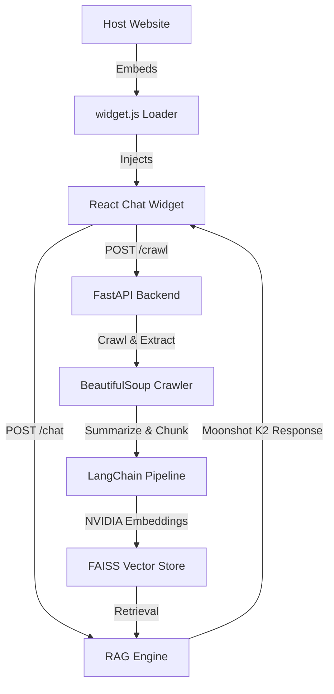

# 🚀 Universal Website-Aware RAG Chatbot

This project is a **plug-and-play AI chatbot infrastructure** that turns any website into its own intelligent assistant. By embedding a single script tag, the chatbot automatically detects the current domain, crawls its content, generates embeddings, and answers user questions grounded strictly in that website’s data.

---

## 🌟 Key Features

- **Universal Embed SDK**: A single `<script>` tag installation that auto-adapts to any host domain.
- **Deep Website Awareness**: Automatic sitemap detection and recursive crawling (up to 100 pages) to index full website context.
- **High-Performance RAG**: Built with **LangChain** and **NVIDIA AI Endpoints**, utilizing the **Moonshot K2 Instruct** model for superior reasoning.
- **Stable Vector Storage**: Uses **FAISS** (Facebook AI Similarity Search) with MD5-hashed domain namespaces for cross-platform reliability (Windows/Linux/macOS).
- **Premium UI/UX**: A floating React widget with **Glassmorphism design**, smooth **Framer Motion** animations, and source citations for transparency.

---

## 🛠️ Tech Stack

- **Backend**: FastAPI (Python 3.14+)
- **ORCHESTRATION**: LangChain (LCEL)
- **AI Models**: NVIDIA AI Endpoints (Moonshot K2 Instruct)
- **Vector DB**: FAISS
- **Frontend**: React 18, Vite, Lucide Icons, Framer Motion
- **Scraping**: BeautifulSoup4, Requests

---

## 📁 Architecture



---

## 🚀 Getting Started

### 1. Prerequisites
- Python 3.10+
- Node.js & npm
- NVIDIA AI Endpoint API Key

### 2. Backend Setup
1. Navigate to the backend folder:
   ```bash
   cd backend
   ```
2. Create a `.env` file:
   ```env
   NVIDIA_API_KEY=your_api_key_here
   ```
3. Run the API:
   ```bash
   python main.py
   ```

### 3. Frontend / Widget Setup
1. Navigate to the widget folder:
   ```bash
   cd widget
   ```
2. Build the bundle:
   ```bash
   npm install
   npm run build
   ```
3. The built widget will auto-sync to the backend's static directory.

### 4. Testing
Open **`http://127.0.0.1:8000/static/index.html`** in your browser to see the demo site and live chatbot.

---

## 🔧 Engineering Challenges & Solutions

| Challenge | Solution |
| :--- | :--- |
| **Windows Path Restrictions** | Implemented **MD5 hashing** for domain names to ensure vector store directories never contain invalid characters like `:` or `@`. |
| **Browser Crash (Process Error)** | Added a **browser polyfill** to the widget loader to handle dependencies that erroneously look for Node.js environment variables. |
| **Library Incompatibility** | Switched from ChromaDB to **FAISS** to resolve Rust-binding issues on newer Python versions (3.14), ensuring 100% platform stability. |
| **Single-Script Deployment** | Configured Vite to bundle React, CSS, and Icons into a **single IIFE file** for seamless injection into any website without asset-loading issues. |

---

## 📜 Roadmap & Future Updates
- [ ] **Suggested Questions**: AI-generated prompts based on page context.
- [ ] **Streaming Responses**: Real-time token streaming via Server-Sent Events (SSE).
- [ ] **Memory**: Multi-turn conversation history storage.
- [ ] **SaaS Dashboard**: Admin panel to monitor indexed domains and usage analytics.

---

*Build by Antigravity (Advanced Agentic Coding)*
