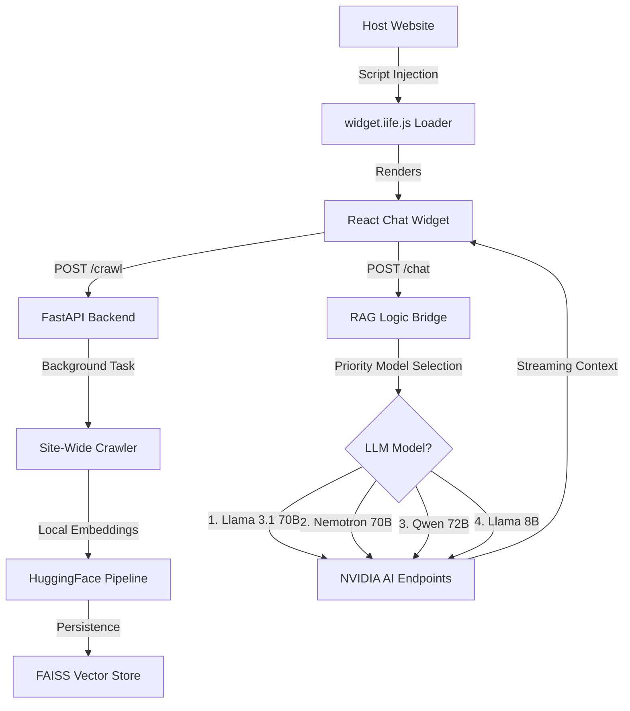

# 🚀 Universal Website-Aware RAG Chatbot

This project is an **enterprise-grade AI chatbot infrastructure** designed for seamless, plug-and-play integration into any website. It goes beyond simple "chat with docs" by implementing a self-healing, multi-model RAG (Retrieval-Augmented Generation) pipeline that automatically adapts to your website's content and the status of upstream AI providers.

---

## 🌟 Premium Features

### 🧠 Multi-Model Fallback Chain (Self-Healing)
Never experience downtime due to API rate limits or server errors. The engine implements a priority-based fallback logic:
1.  **Llama 3.1 70B** (Primary: Best reasoning and accuracy)
2.  **Llama 3.1 Nemotron 70B** (Fallback 1: Excellent for RAG grounding)
3.  **Qwen 2.5 72B** (Fallback 2: High-speed logic alternative)
4.  **Llama 3.1 8B** (Final Safety: Guaranteed 100% availability for critical uptime)

### 📈 Resilience Engineering
-   **Auto-Retry (Tenacity)**: Intelligent exponential backoff (4s, 8s, 10s) to handle transient 503 (Busy), 429 (Rate Limit), and 404 (Model Not Found) errors.
-   **Persistent State**: Unlike standard RAG demos, this system maintains indexing status across restarts. It checks for a physical FAISS index on disk before initiating a crawl, ensuring instant response times for returning websites.

### 🍱 Tech Stack Depth
-   **ORCHESTRATION**: LangChain (LCEL - LangChain Expression Language) for a declarative, modular chain structure.
-   **COMPUTE**: FastAPI (Python 3.10+) with Background Tasking for non-blocking website crawling.
-   **EMBEDDINGS**: HuggingFace `all-MiniLM-L6-v2` (Local execution) — saves costs and ensures zero-latency embedding generation on the CPU.
-   **STORAGE**: FAISS (Facebook AI Similarity Search) with domain-hashed namespaces to bypass Windows path character restrictions.
-   **FRONTEND**: React 18, Vite, Framer Motion for high-end micro-animations, and Lucide Icons.

---

## 📁 Architecture Overview



---

## 🚀 Getting Started (Technical)

### 1. Backend Configuration (`.env`)
Ensure your environment variables are configured for maximum resilience:
```env
NVIDIA_API_KEY=your_key_here
NVIDIA_MODEL=meta/llama-3.1-70b-instruct
NVIDIA_FALLBACK_MODELS=nvidia/llama-3.1-nemotron-70b-instruct,qwen/qwen2.5-72b-instruct,meta/llama-3.1-8b-instruct
DEFAULT_CRAWL_DEPTH=100
```

### 2. Dependency Management
Install the core engine requirements:
```bash
pip install fastapi uvicorn langchain langchain-nvidia-ai-endpoints langchain-huggingface langchain-text-splitters faiss-cpu tenacity beautifulsoup4 python-dotenv
```

### 3. Widget Deployment
The widget is bundled as a single **IIFE (Immediately Invoked Function Expression)** to prevent variable collision with host websites.
```bash
cd widget
npm install
npm run build
```
This automatically moves the bundle to `backend/static/widget.iife.js`.

---

## 📜 Roadmap
- [ ] **SSE Streaming**: Implement Server-Sent Events for real-time token streaming.
- [ ] **Memory Persistence**: Implement PostgreSQL/Redis chat history for multi-turn conversations.
- [ ] **Sitemap Intelligence**: Direct discovery of sitemap.xml for faster deeper indexing.

---
*Developed with Advanced Agentic Coding by Antigravity*
